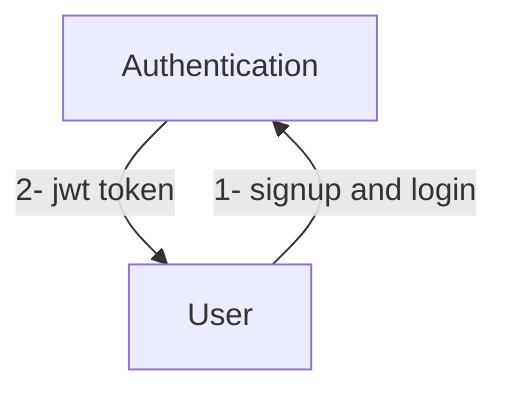
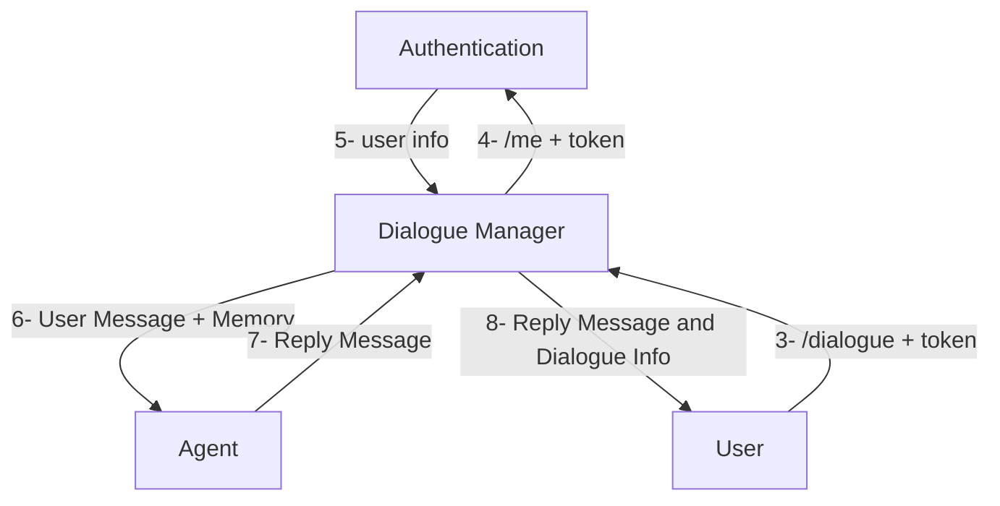

# IFSGuideTask
IFS Guide Task

# System design
The application's design revolves around a well-thought-out architecture that emphasizes scalability and a clear separation of concerns. It comprises three distinct services, each tailored to perform a unique role within the system. Firstly, the 'Auth' service serves as a centralized authentication mechanism, employing JWT-based authentication to ensure secure access to the application's resources. Secondly, the 'Dialogue Manager' emerges as the core component, orchestrating the exchange of messages and managing dialogues (a.k.a chats and conversations). It maintains communication with the underlying database, ensuring the persistence and retrieval of critical data. Finally, the 'Agent' service stands as a specialized component, dedicated to housing and operating a Large Language Model (LLM). This service harnesses the power of LLMs to facilitate advanced natural language processing, enhancing the application's conversational capabilities. Together, these services create a robust and modular system, promoting scalability and effective separation of responsibilities for a seamless user experience.

## Components are wired as follows:





# Endpoints

**Auth**
```code
POST /api/v1/signup
POST /api/v1/login
GET /api/v1/me
```
**Dialogue Manager**
```code
POST /api/v1/dialogue
GET /api/v1/dialogues
GET /api/v1/messages
```
**Agent**
```code
GET /api/v1/agent
```

As a side note, you can create a new dialogue by calling /api/v1/dialogue only providing a message or you can continute a dialogue by passing dialogue_id as well. Authorization to dialogues and messages are made by dialogue manager after consulting with /api/v1/me from auth service.

# Data Modeling Mindset
There is no **dialogue** entity in the system design because it does not add any value to the functionality of the system at the moment. As a result, all of the data can be modeled in a single database table, making it suitable for validity processes, integrity checking and further analytics. In this mindset **dialogues** are modeled as **doubly linked lists** of messages.

# Further Improvements
One can argue that RDBMS are not the most efficient methods of storing data and it is definately right. Postgresql is used here only for convinience and at the production scale can be replaced with databases with better support for **linked list** data models.
Another improvement can be made on the database for authentication service which is chosen to be redis for now as a way of to avoid further complexity.

# Setup
## Download and Convert the agent model
In this particular example, I used llama2 7b chat in gguf format with q2 quantization in order to make it executable on various devices without GPU concerns.
The model is available in ggml format at
```url
https://huggingface.co/TheBloke/Llama-2-7B-Chat-GGML/resolve/main/llama-2-7b-chat.ggmlv3.q2_K.bin
```
This model must be converted to gguf format by running the following command:
```url
python llama.cpp/convert-llama-ggml-to-gguf.py --input /path/to/llama-2-7b-chat.ggmlv3.q2_K.bin --output /path/to/llama-2-7b-chat.gguf.q2_K.bin
```
The required script is available at <https://github.com/ggerganov/llama.cpp/blob/master/convert-llama-ggml-to-gguf.py>

## Run services
There is a docker-compose file which can be used to run the whole system. However before running make sure to change the sample env file accordingly.